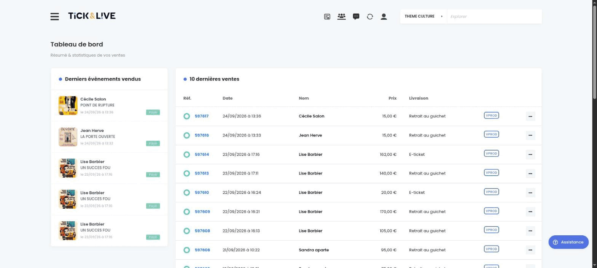

# La boîte&nbsp;à&nbsp;outils qu'on ne réinvente plus

<p class="muted">Notre suite Symfony, éprouvée, open source, prête pour les agents</p>

<div class="speakers-row"><span><Chip who="joel" />Aropixel · Bordeaux</span></div>

<!--
[Repère de répétition : lightning talk, 5 minutes chrono. Ne pas dépasser. Onze slides plus une optionnelle (page builder) à sauter si le chrono dépasse 4 min. make:crud n'est révélé que sur la slide agents.]

Bonjour à tous. Je suis Joel, développeur chez Aropixel, une agence à Bordeaux qui fait du Symfony depuis plus de dix ans.

Je vais vous parler de notre suite de bundles d'administration open source.
-->

---
layout: statement
section: 1:constat
speakers: [ joel ]
---

# Un nouveau projet Symfony ?

<p class="muted">Un nouveau back-office à coder.</p>

<!--
Chaque projet qu'on livre a besoin d'un espace d'administration : gérer des contenus, des utilisateurs, des droits, des médias, et même des pages et des articles de blog.

Et pendant longtemps, on a fait comme tout le monde : on recode un bout de back-office à chaque fois. Des formulaires, des CRUD, des uploads d'images, encore, et encore.
-->

---
layout: statement
section: 1:constat
speakers: [joel]
dark: true
---

# Chez nous, plus depuis longtemps.

<!--
Ça fait plus de dix ans qu'on n'a plus ce problème.

On a extrait cette brique une bonne fois pour toutes, on l'a affinée projet après projet, et on l'a rendue open source.
-->

---
section: 2:suite
speakers: [joel]
---

# 4 bundles, une seule philosophie

<div class="cards cards-2">
  <div class="card">
    <span class="card-title">Admin</span>
    <span class="card-text">Le cœur : back-office léger et extensible, FormTypes et layouts de formulaires.</span>
  </div>
  <div class="card">
    <span class="card-title">Pages</span>
    <span class="card-text">Gestion de pages structurées, page builder, alternative légère aux CMS.</span>
  </div>
  <div class="card">
    <span class="card-title">Blog</span>
    <span class="card-text">Actualités et articles, intégrable à toute application Symfony existante.</span>
  </div>
  <div class="card">
    <span class="card-title">Menu</span>
    <span class="card-text">Navigation en drag & drop, multi-niveaux.</span>
  </div>
</div>

<p class="small muted">Licence MIT · Symfony 6.4 à 8 · maintenus en continu</p>

<!--
Concrètement, c'est quatre bundles : 
- Admin, qui est le cœur du pilotage, avec des FormTypes et leurs layouts prêts à l'emploi. 
- Pages, pour du contenu structuré façon page builder. 
- Blog, pour l'éditorial. 
- Et Menu, pour la navigation en drag & drop.

Tout est en licence MIT, compatible avec Symfony 6.4 à 8, et surtout : c'est ce qu'on utilise en production, sur tous nos projets, donc c'est éprouvé.
-->

---
section: 2:suite
speakers: [joel]
class: tight
---

# Un back-office complet

<div class="shot"></div>

<p class="small muted">Tableau de bord · listing avec tri et recherche · formulaires à onglets · éditeur riche · médiathèque.</p>

<!--
Voilà à quoi ça ressemble. 

- Des listes basées sur Datatable, avec recherche et pagination. 
- Un formulaire d'édition organisé en onglets
- Gestion et rendu des images
- Gestion et rendu des relations et collections
- Editeur QuillJs embarqué 
- Les utilisateurs et les droits sont déjà là.

Rien d'exotique : c'est un back-office propre et extensible.
-->

---
section: 2:suite
speakers: [joel]
class: tight compact
---

# Ce que c'est, ce que ce n'est pas

<div class="cards cards-2">
  <div class="card">
    <span class="card-title">Ce n'est pas</span>
    <span class="card-text"><strong>Un EasyAdmin bis</strong> : vos écrans ne sortent pas d'une config, leur code est dans votre projet.</span>
    <span class="card-text"><strong>Une black box</strong> : rien à contourner quand vous sortez des rails.</span>
    <span class="card-text"><strong>Un CMS</strong> : aucun modèle de contenu imposé.</span>
  </div>
  <div class="card">
    <span class="card-title">C'est</span>
    <span class="card-text"><strong>Une boîte à outils</strong> pour développeurs Symfony.</span>
    <span class="card-text"><strong>Du code qui vit dans votre projet</strong> : vos entités, vos FormTypes, vos controllers.</span>
    <span class="card-text"><strong>Une fondation éprouvée</strong> : dix ans, tous nos projets.</span>
  </div>
</div>

<!--
Ce n'est pas un EasyAdmin bis : EasyAdmin génère vos écrans à partir d'une config ; ici, le code des écrans est dans votre projet. Ce n'est pas une black box, et ce n'est pas un CMS.

C'est une boîte à outils pour développeurs. Le code vit dans votre projet, dans votre Symfony : vos entités, vos FormTypes, vos controllers. Le bundle vous donne les services et les composants, et il s'efface.
-->

---
section: 3:démarrer
speakers: [joel]
---

# Un projet en une commande

```bash
aropixel-starter new:admin mon-projet --all
```

<p class="small muted">Docker Starter de JoliCode · Varnish · Mailpit · bundles à la carte · déploiement Clever Cloud · skills Claude Code — tout prêt.</p>

<!--
Pour pouvoir démarrer un projet en quelques secondes, on a mis en place aropixel-starter, un runner de tâches Castor. 

En une commande, vous avez un projet Symfony complet : le Docker Starter de JoliCode, le bundle Admin installé avec un compte administrateur, les bundles Page, Blog et Menu à la carte, et le déploiement Clever Cloud déjà configuré.
-->

---
section: 4:formtypes
speakers: [joel]
class: tight
---

# Des widgets en quelques lignes

<div class="cols-2 code-small">
<div>

```php
$builder
  ->add('title', TextType::class)
  ->add('category', EntityType::class, [
      'class' => Category::class,
  ])
  ->add('published', ToggleSwitchType::class)
  ->add('cover', ImageType::class);
```

</div>
<div>

```twig
{{ form_row(form.title) }}
{{ form_row(form.category) }}
{{ form_row(form.published) }}
{{ form_row(form.cover) }}
```

</div>
</div>

<div class="shot shot-small"></div>

<p>Zéro configuration, <mark>zéro JavaScript à écrire.</mark></p>

<!--
La promesse de base, elle est toute simple. 

- Un formulaire Symfony ordinaire : un texte, une relation, un booléen, une image. 
- Un template avec quatre form_row. 
- Et le résultat : un select, un toggle, un upload avec médiathèque partagée et recadrage.

Le layout et les bibliothèques sont prêts. 
Aucune configuration en plus, aucun JavaScript à écrire.
-->

---
section: 4:formtypes
speakers: [joel]
class: tight
---

# 19 FormTypes prêts à l'emploi

<div class="cards cards-3">
  <div class="card">
    <span class="card-title">Médias</span>
    <ul>
      <li><code>ImageType</code> upload, médiathèque, recadrage</li>
      <li><code>GalleryType</code> images triables</li>
      <li><code>VideoType</code> embed vidéo avec aperçu</li>
      <li>…</li>
    </ul>
  </div>
  <div class="card">
    <span class="card-title">Données</span>
    <ul>
      <li><code>Select2Type</code> recherche AJAX</li>
      <li><code>CollectionType</code> lignes triables en drag & drop</li>
      <li><code>TranslatableType</code> champs traduisibles</li>
      <li>…</li>
    </ul>
  </div>
  <div class="card">
    <span class="card-title">Saisie</span>
    <ul>
      <li><code>EditorType</code> éditeur riche QuillJS</li>
      <li><code>DateTimeType</code> avec pickers</li>
      <li><code>ColorType</code> color picker</li>
      <li>…</li>
    </ul>
  </div>
</div>

<p class="small muted">Chacun a son bloc Twig, surchargeable dans votre form theme.</p>

<!--
Le bundle en embarque dix-neuf, documentés. Quelques exemples : l'image avec médiathèque et recadrage, la galerie triable, le select avec recherche AJAX, les collections en drag & drop, l'éditeur riche.

Chaque type a son bloc Twig. Si le rendu ne vous convient pas, vous le surchargez dans votre form theme, comme d'habitude.
-->

---
section: 5:agents
speakers: [joel]
class: tight
---

# Un prompt, un CRUD

<div class="ask"><span class="ask-caret">&gt;</span>« Crée l'admin des articles : titre, couleur, éditeur riche, date de publication et tags. »</div>

<div class="cols-2 code-small">
<div>

```php
// src/Form/ArticleType.php
$builder
  ->add('title', TextType::class)
  ->add('mainColor', ColorType::class)
  ->add('content', EditorType::class)
  ->add('publishedAt', DateTimeType::class)
  ->add('tags', FilterableEntitiesType::class);
```

</div>
<div class="files">
<span>Puis <mark>aropixel:make:crud</mark> génère :</span>
<span><code>src/Controller/Admin/ArticleController.php</code><span class="muted">index (DataTable), new, edit, delete</span></span>
<span><code>templates/admin/article/index.html.twig</code><span class="muted">liste</span></span>
<span><code>templates/admin/article/form.html.twig</code><span class="muted">formulaire</span></span>
</div>
</div>

<p class="small muted">Les skills Claude Code, livrées avec le bundle, complètent colonnes, recherche et tri. Agents et devs : même toolbox.</p>

<!--
Et c'est là que ça devient intéressant avec les agents. Un prompt : « crée l'admin des articles ».

Comme tout est du Symfony ordinaire, l'agent écrit le FormType comme un dev, puis il exécute notre make:crud, qui génère le controller, la liste et le formulaire. Les skills livrées avec le bundle complètent colonnes, recherche et tri.

Pas de couche en plus : les agents pilotent la même toolbox que nous. Ça va juste encore plus vite.
-->

---
section: 6:bonus
speakers: [joel]
class: tight
---

# PageBundle : le page builder

<div class="shot"></div>

<p class="small muted">Blocs visuels · HTML pré-rendu · pages fixes · champs SEO. Une alternative légère au CMS.</p>

<!--
[Optionnelle : à sauter si le chrono dépasse 4 min en arrivant ici.]

Un dernier mot sur PageBundle. C'est un page builder par blocs, avec du HTML pré-rendu, des pages fixes et les champs SEO. Pour la plupart de nos sites, ça remplace un CMS.
-->

---
section: 7:fin
speakers: [joel]
---

<div class="contact">
<div class="contact-main">

# Merci

<p class="muted">github.com/aropixel · aropixel.com</p>

<div class="logos"></div>

</div>
<div class="shot"></div>
</div>

<!--
Voilà. Une toolbox éprouvée, dix ans de production, quatre bundles open source, et maintenant prête pour que les agents contribuent avec nous.

Tout est sur github.com/aropixel, en licence MIT. Venez piocher dedans, ou venez contribuer.

Merci !
-->
